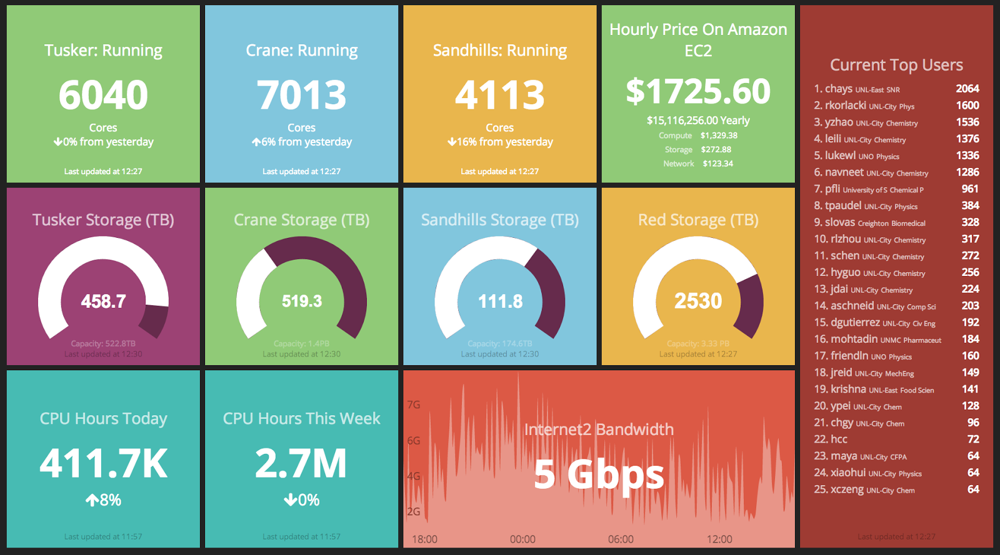
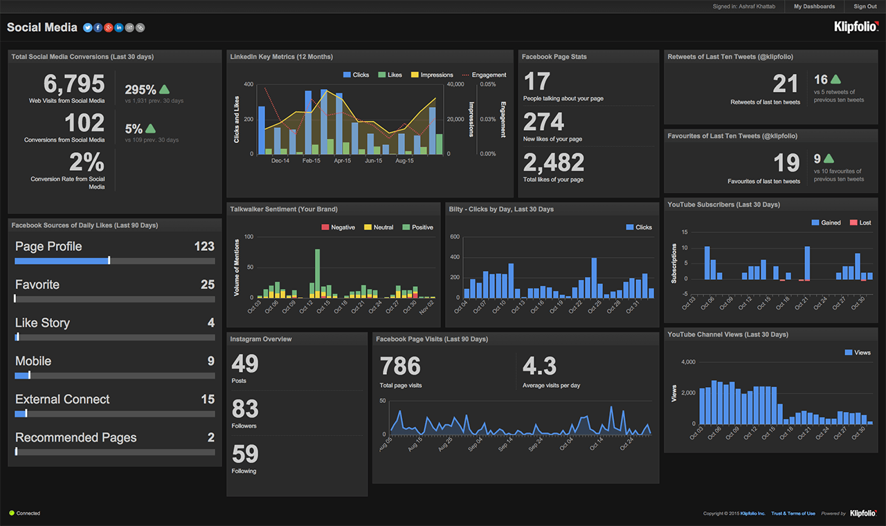
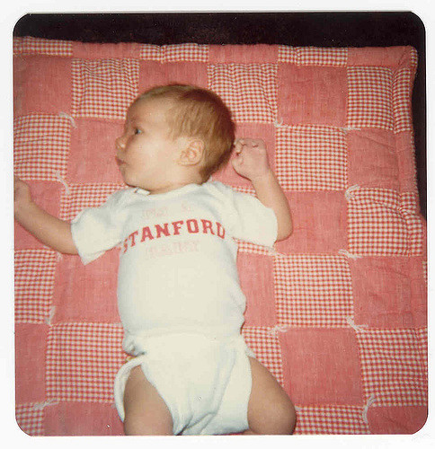
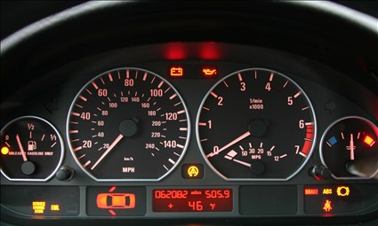
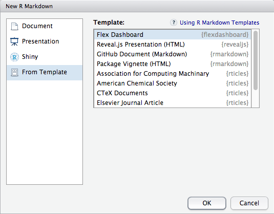
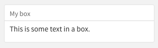
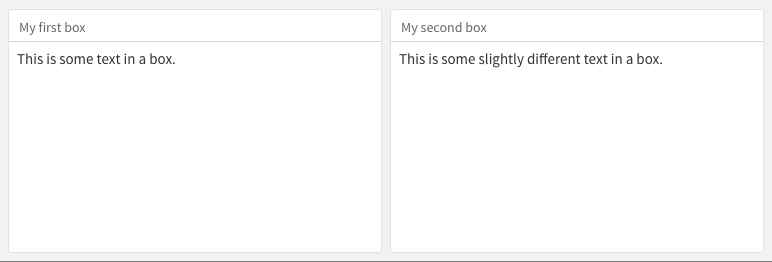
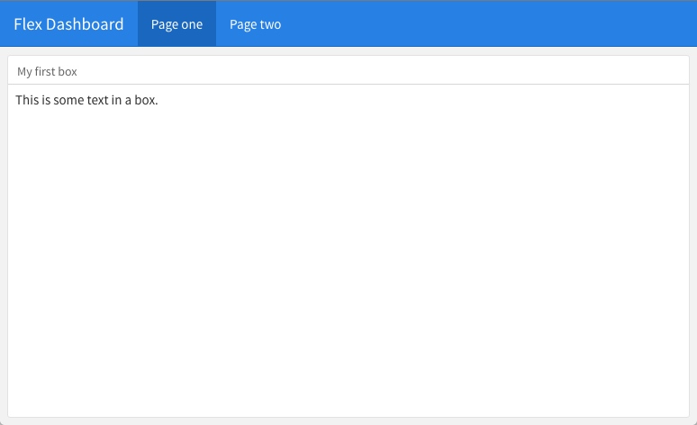
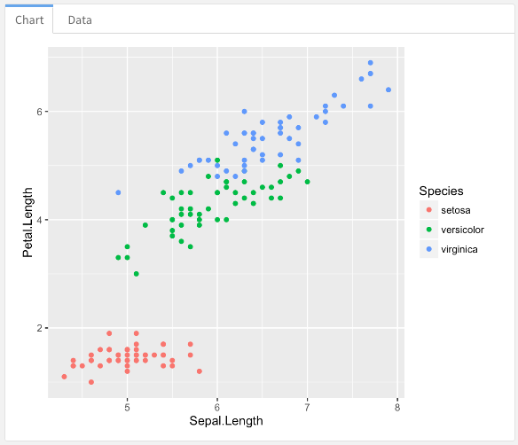
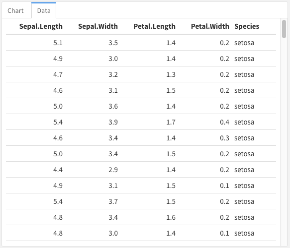

```{r setup, include=FALSE}
knitr::opts_chunk$set(echo = TRUE)
```

# Introduction

## Outline

1. What's a dashboard?
2. Dashboard layouts
3. Dashboard components
4. Interactive dashboards
5. flexdashboard vs. shinydashboard

## What's a dashboard?


## This is a dashboard


## This is a dashboard



## This is a dashboard



## This is not a dashboard



## This is a dashboard



## What's a dashboard?

- A communications tool showing relevant information about different aspects of a system
- Full-screen, space-consuming layout
    - Often via subdivision
- High-level trends and summaries favored over details
- Information designed for quick, glancing consumption

## Why build one with R?

- Reproducible; bundles analysis with presentation and communication
- Eliminate the middleman; empower analysts to produce executive-grade dashboards
- Virtually infinite customizability

# Introducing flexdashboard

## What is flexdashboard?

- R package designed to produce beautiful dashboards easily
- Built on R Markdown
- Expresses the structure of a dashboard declaratively using Markdown
- Bundles common dashboard user interface components

## Installation

```{r eval=FALSE}
install.packages("flexdashboard", type = "source")
```

# flexdashboard Examples

## 

<iframe src="wastelands.html" width="800" height="600">
</iframe>

## 

<iframe src="salesreport.html" width="800" height="600">
</iframe>

## 

<iframe src="tor.html" width="800" height="600">
</iframe>

# Getting Started

## Via RStudio



## Via the R prompt

```{r eval=FALSE}
rmarkdown::draft("dashboard.Rmd", 
                 template = "flex_dashboard", 
                 package = "flexdashboard")
```

## YAML header

    ---
    title: "Flex Dashboard"
    output: flexdashboard::flex_dashboard
    ---
    
# Dashboard Layout

## The Big Idea

- Use Markdown headings to describe the boxes and space division of your dashboard
    - Layout is implicit and automatic
    - Tweakable with custom attributes
- Content in your boxes fills the box automatically
- Supply gaps between R offerings and common dashboard components

## Level three: boxes.


    ### This is a box. 
    
    This is some text in the box.
  



## Level two: columns


    ## My first column
    
    ### My first box
    
    This is some text in a box.
    
    ## My second column
    
    ### My second box
    
    This is some slightly different text in a box.
    
## Level two: columns



## Level one: pages

    # Page one
    
    ### My first box
    
    This is some text in a box.
    
    # Page two
    
    ### My second box
    
    This is some slightly different text in a box.

## Level one: pages



## Layout Recap:

- flexdashboards are composed of space-filling boxes created with level 3 headers (`###`)
- Boxes can be grouped into columns (or rows, or tabs) with level 2 headers (`##`)
- Pages can group other kinds of components
- Much more advanced layout is possible (see docs for details)

# Components

## Plots and HTML widgets

- Any R graphics are supported
- Graphs and visualizations: the basic building blocks of most dashboards
- Contents automatically scaled to the size of the box
- HTML widgets can include interactivity 

## Plots and HTML widgets

    ### Iris data
    
```{r, echo = FALSE, results="asis"}
cat("    ```{r}",
    "    qplot(Sepal.Length, Petal.Length, data = iris, color = Species)",
    "    ```", sep = "\n")
```
    
    ### Birthplace of R

```{r, echo = FALSE, results="asis"}
cat("    ```{r}",
    "    library(leaflet)",
    "    m <- leaflet() %>%",
    "      addTiles() %>% ",
    "      addMarkers(lng=174.768, lat=-36.852, popup=\"The birthplace of R\")", 
    "    ```",
    sep = "\n")
```

## Plots and HTML widgets


## Value boxes

```{r, eval=FALSE}
library(flexdashboard)
articles <- 204
valueBox(articles, 
         icon = "fa-pencil", 
         caption = "Articles per Day")
```


## Gauges
 
```{r, eval=FALSE}
satisfaction <- 86
gauge(satisfaction, min = 0, max = 100, symbol = '%', 
  label = "Satisfaction", gaugeSectors(
  success = c(80, 100), warning = c(40, 79), danger = c(0, 39)
))
```


## Including Data: tabsets

    ## Column {.tabset}
     
    ### Chart 

```{r echo=FALSE, results='asis'}
cat(paste("    ```{r}",
          "    qplot(Sepal.Length, Petal.Length, data = iris, color = Species) ", 
          "    ```", sep = "\n"))
```
    
    ### Data
    
```{r echo=FALSE, results='asis'}
cat(paste("    ```{r}",
          "    knitr::kable(iris)", 
          "    ```", sep = "\n"))
```
    
## Including Data: Chart



## Including Data: Table



# Interactive Dashboards

## Interactivity with HTML widgets

- Simplest form of interactivity
- Static HTML; no special client or server requirements
    - Host anywhere, view anywhere
- Data must be fixed (can't run R code)
- Interaction within single widget only 
    - Most widgets don't talk to each other (yet)

## HTML widget interactivity

```{r, eval=FALSE}
library(dygraphs)
lungDeaths <- cbind(mdeaths, fdeaths)
dygraph(lungDeaths) %>% 
   dyRangeSelector()
```

## HTML widget interactivity 

```{r, echo=FALSE}
library(dygraphs)
lungDeaths <- cbind(mdeaths, fdeaths)
dygraph(lungDeaths) %>% 
   dyRangeSelector()
```

## Interactivity with Shiny

- Stream data and update in real time
- More advanced interactivity
- Components can react to each other 
- R expressions can be evaluated in response to interaction
- Deployment requires Shiny server or shinyapps.io

## flexdashboard vs. shinydashboard

- Static host vs. Shiny Server (or shinyapps.io)
- Simplicity vs. complexity
- Constraints vs. flexibility

## Advanced topics

- Layout tweaking: adjust column widths/sizes
- Mobile friendliness
   - Largely automatic but can show/hide specifically
- Storyboards
- Navigation

# Wrap - up / Q & A

## Links

    https://github.com/jmcphers/flexdashboard-talk

- [flexdashboard documentation](http://rmarkdown.rstudio.com/flexdashboard/)
- [HTML widget crosstalk](https://github.com/rstudio/crosstalk)
- [HTML widget showcase](http://www.htmlwidgets.org/showcase_leaflet.html)
